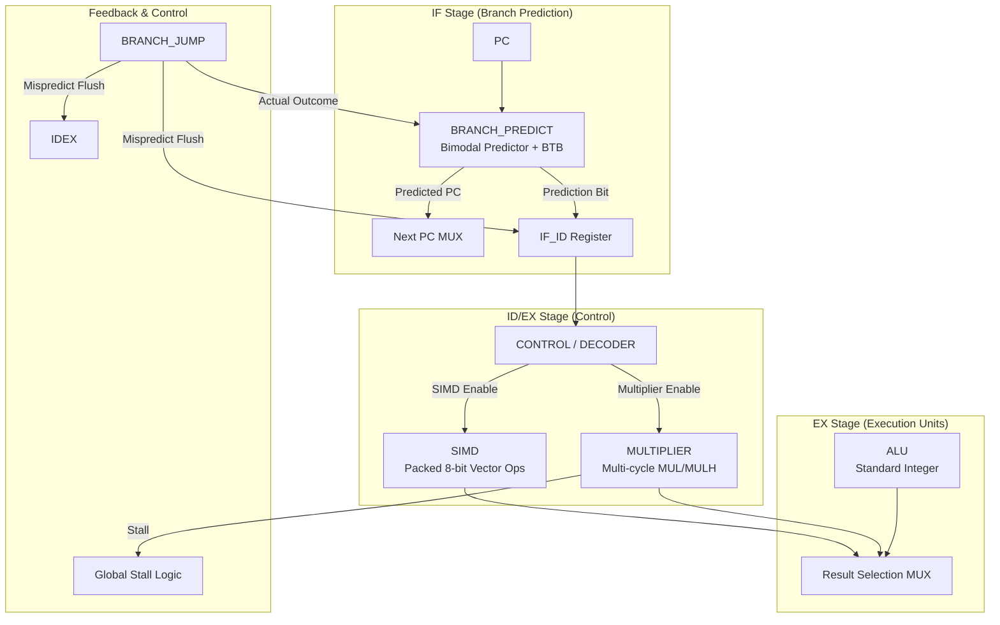

# Phase 7 — Performance & Extensions: Implementation Plan & Testing Guidelines

> **Project**: RISC-V 5-Stage Pipelined CPU — Advanced Features  
> **Current State**: Phase 6 complete (Caches, Miss Handler, LRU/Prefetch)  
> **Goal**: Implement Dynamic Branch Prediction, a hardware Multiplier unit, and SIMD (Single Instruction, Multiple Data) support to enhance performance and functional capabilities.

---

## Architecture Overview — Phase 7 Enhancements



---

## 🆕 New Files to Create (3 files)

### 1. `BRANCH_PREDICT.v` — Dynamic Branch Prediction *(Eren)*

**Purpose**: Reduce control hazard penalties by predicting branch outcomes and target addresses in the IF stage.

**Architecture**:
- **Bimodal Predictor**: A table of 2-bit saturating counters indexed by the lower bits of the PC.
  - `00`: Strongly Not Taken
  - `01`: Weakly Not Taken
  - `10`: Weakly Taken
  - `11`: Strongly Taken
- **Branch Target Buffer (BTB)**: A cache-like structure storing the target address for branches previously seen as "Taken".

**Interface**:
```verilog
module BRANCH_PREDICT #(
    parameter TABLE_SIZE = 256,
    parameter TAG_BITS   = 10
) (
    input  wire        iClk,
    input  wire        iRstN,
    // IF Stage Request
    input  wire [31:0] iIF_PC,
    output wire        oPrediction,    // 1 = Taken, 0 = Not Taken
    output wire [31:0] oPredictedPC,
    // EX Stage Feedback (Update logic)
    input  wire        iUpdateEn,      // Asserted when a branch completes in EX
    input  wire [31:0] iUpdatePC,
    input  wire [31:0] iActualTarget,
    input  wire        iActualTaken
);
```

---

### 2. `MULTIPLIER.v` — Hardware Multiplier (M-Extension) *(Kai)*

**Purpose**: Implement integer multiplication instructions (`MUL`, `MULH`, `MULHSU`, `MULHU`) without bloating the critical path of the ALU.

**Architecture**:
- **Multi-cycle Design**: 4-cycle sequential multiplier (e.g., using a radix-4 Booth algorithm or a simple iterative shift-and-add).
- **Signed/Unsigned Support**: Handles both 2's complement and unsigned operands based on instruction type.

**Interface**:
```verilog
module MULTIPLIER (
    input  wire        iClk,
    input  wire        iRstN,
    input  wire [31:0] iDataA,
    input  wire [31:0] iDataB,
    input  wire [2:0]  iFunct3,        // To distinguish MUL, MULH, etc.
    input  wire        iStart,         // Trigger multiplication
    output reg  [31:0] oResult,
    output wire        oBusy,          // High while calculating
    output wire        oDone           // Pulse high on completion
);
```

---

### 3. `SIMD.v` — Single Instruction Multiple Data *(Orion)*

**Purpose**: Accelerate data-parallel workloads by performing multiple operations in a single cycle.

**Architecture**:
- **Packed 8-bit Ops**: Supports 4-way parallel 8-bit addition/subtraction within a 32-bit word.
- **No-Carry Propagation**: Ensures carries from one 8-bit lane do not affect adjacent lanes.

**Interface**:
```verilog
module SIMD (
    input  wire [31:0] iDataA,
    input  wire [31:0] iDataB,
    input  wire [2:0]  iSimdOp,        // 000 = VADD8, 001 = VSUB8, etc.
    output wire [31:0] oResult
);
```

---

## ✏️ Existing Files to Modify (5 files)

### 4. [RISCV_TOP.v](file:///c:/Users/Deoxon/OneDrive%20-%20University%20of%20Central%20Florida/Spring%202026/Comp%20Arch/Project/Group%20Ones/Phase%207/RISCV_TOP.v) — Top-Level Integration *(Dawn)*

#### Change 1: IF Stage Prediction
- Instantiate `BRANCH_PREDICT`.
- Update the Next PC logic to select between predicted PC and sequential PC.

#### Change 2: EX Stage Execution Units
- Instantiate `MULTIPLIER` and `SIMD`.
- Add a result selection MUX to choose between ALU, Multiplier, and SIMD outputs.

#### Change 3: Misprediction & Flush Logic
- Add logic in EX to detect mispredictions.
- Trigger pipeline flushes and PC redirection on misprediction.

#### Change 4: Multi-cycle Stall
- Integrate Multiplier `oBusy` into the global stall logic to freeze the pipeline during calculation.

---

### 5. [CONTROL.v](file:///c:/Users/Deoxon/OneDrive%20-%20University%20of%20Central%20Florida/Spring%202026/Comp%20Arch/Project/Group%20Ones/Phase%207/CONTROL.v) & [ALU_CONTROL.v](file:///c:/Users/Deoxon/OneDrive%20-%20University%20of%20Central%20Florida/Spring%202026/Comp%20Arch/Project/Group%20Ones/Phase%207/ALU_CONTROL.v) — Instruction Decoding *(Dawn)*

- Update decoding logic to recognize:
  - M-extension R-type instructions (Funct7 = `7'b0000001`).
  - Custom SIMD instructions.

---

## 🧪 Testing Guidelines

### Unit Testing (Stage 1)

| Module | Test Case | Expected Behavior |
|--------|-----------|-------------------|
| **BRANCH_PREDICT** | Counter Saturation | `01 -> 10 -> 11` on successive "Taken" updates. |
| **BRANCH_PREDICT** | BTB Target | Target address stored and returned correctly on next PC hit. |
| **MULTIPLIER** | Signed MUL | `(-5) * (10) = -50` |
| **MULTIPLIER** | Busy/Stall | `oBusy` stays high for exactly N cycles, then `oDone` pulses. |
| **SIMD** | VADD8 | `0x01020304 + 0x01010101 = 0x02030405` |
| **SIMD** | Carry Isolation | `0xFF + 0x01` in a lane results in `0x00` in that lane, no carry to next. |

### Integration Testing (Stage 2)

#### 1. Branch Misprediction Stress Test
- Run assembly loops.
- Verify pipeline flushes correctly on loop exit.

#### 2. Multiplier Performance Test
- Run multiplication-heavy programs.
- Verify results against a golden reference.

#### 3. SIMD Benchmark
- Compare vector addition speed between standard ALU and SIMD implementations.

---

## Execution Order

1.  **Phase 7 Foundation**: Modify `CONTROL.v` to recognize new instructions.
2.  **Execution Units**: Build `MULTIPLIER.v` and `SIMD.v`.
3.  **Advanced Branching**: Build `BRANCH_PREDICT.v`.
4.  **Top-Level Integration**: Wire everything in `RISCV_TOP.v`, add stall and flush logic.
5.  **Final Verification**: Run integration test suite.
